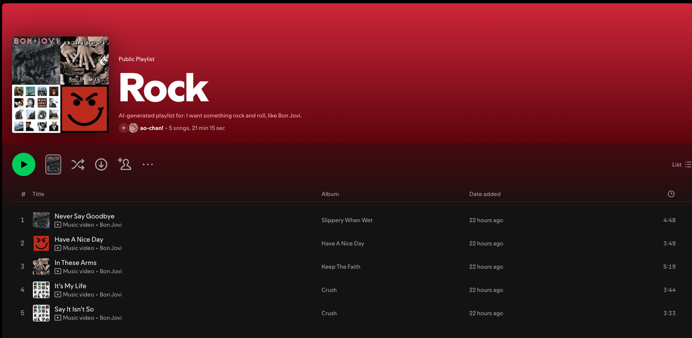
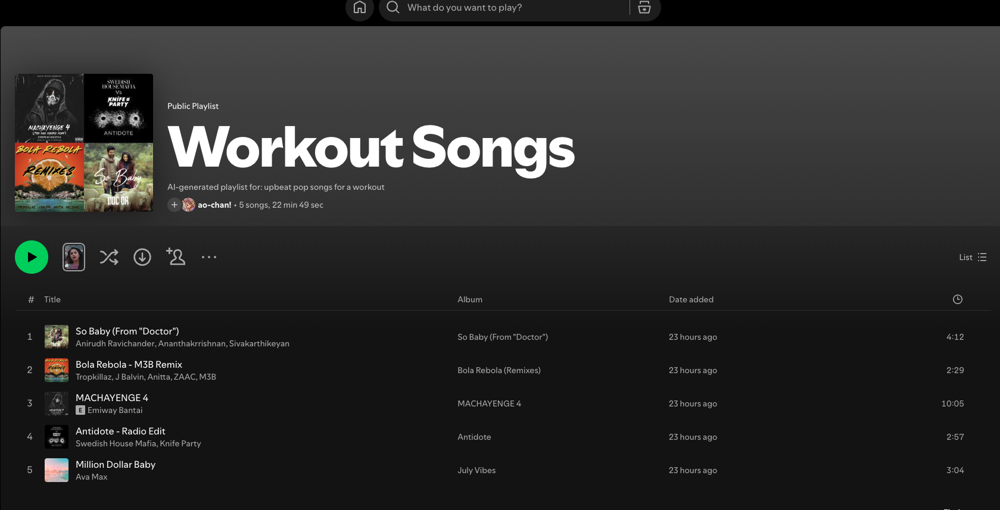

# 🎵 Music Recommender Simulation

## Project Summary

In this project you will build and explain a small music recommender system.

Your goal is to:

- Represent songs and a user "taste profile" as data
- Design a scoring rule that turns that data into recommendations
- Evaluate what your system gets right and wrong
- Reflect on how this mirrors real world AI recommenders

---

## How AI Is Used In This Project

This project uses a Retrieval-Augmented Generation (RAG) pattern to turn a natural-language music request into a personalized playlist. When you describe what you want to hear, the system parses your prompt to extract signals like a seed artist, mood, or energy level, then retrieves the most relevant songs from a local dataset by scoring each track against those signals using weighted numeric features (energy, valence, tempo, danceability, acousticness) and categorical matches (genre, mood). That retrieved context — the top candidate tracks, the seed artist's audio profile, and a list of similar artists — is injected into a structured prompt and passed to a general-purpose LLM, which generates the final recommendations in natural language and explains why each song fits your request. Because the LLM never guesses from memory but instead reasons over the retrieved data, the output stays grounded in real audio attributes rather than hallucinated suggestions. A reliability and testing system backs the retrieval and enrichment layers: unit tests in `tests/test_recommender.py` and `tests/test_spotify_enrichment.py` verify that scoring logic and data processing behave correctly across edge cases, keeping the RAG pipeline predictable as the dataset and scoring rules evolve.

## How The System Works

## Real World Recommendation Systems
Collaborative filtering and content-based filtering represent two fundamentally different philosophies for predicting what someone will enjoy. Collaborative filtering is entirely social in nature — it ignores the content itself and focuses purely on patterns of human behavior. 

The system looks at what you've listened to, skipped, saved, or replayed, then finds other users whose behavior closely mirrors yours. From there, it recommends things those "taste twins" loved that you haven't encountered yet. The underlying assumption is that if two people agreed on hundreds of songs in the past, they'll probably agree on the next one too. This makes it remarkably good at serendipitous, cross-genre discovery — but it struggles with new users who have no history, and new songs that have no listeners yet.

Content-based filtering sidesteps that problem entirely by analyzing the intrinsic attributes of the content itself rather than relying on other people's opinions. For music, this means breaking a song down into measurable features — tempo, key, loudness, energy, danceability, emotional valence, and even the instruments present — and building a kind of sonic fingerprint for it. 

The system then recommends songs whose fingerprints closely match those of tracks you've already enjoyed.
Because it reasons from the music's own attributes, it works even for obscure or brand-new tracks with no listening data behind them. The tradeoff, however, is that it can trap you in a narrow stylistic bubble, surfacing music that sounds similar to what you know without ever pushing you toward something genuinely surprising. 

In practice, the most sophisticated recommendation systems layer both approaches together — using collaborative filtering for broad discovery and content-based filtering to fine-tune the match — supplemented by natural language processing, engagement signals, and deep learning to capture nuances that neither method alone can fully address.

## System Design Explanation: Music Recommender Simulation
This is a weighted-score music recommendation system designed for educational purposes to understand how AI recommenders match user preferences to song attributes.

## The Core Idea
The system takes a user's music taste profile and finds songs from a catalog that match it best. Instead of guessing randomly, it assigns a numerical score to each song based on how well it aligns with what the user likes. Higher-scoring songs are recommended first.

Some prompts to answer:

- What features does each `Song` use in your system?
The features used in each 'Song' are genre and mood (categorical), energy,  valence, danceability, and acousticness(numeric 0-1 scale), and tempo_bpm (beats per minute). It also incorporates "derived categories (from Spotify data processing) such as detailed_mood, energy_level, danceability_tier, tempo_category, and popularity.

- What information does your `UserProfile` store? The `UserProfile` stores three categories of attributes for each user. First, there are categorical preferences (exact matches). These include favorite_genre,  favorite_mood, target_energy, favorite_detailed_mood, and likes_acoustic (as a Boolean true/false value). 

Next, there are numerical targets which are similarity based (on the user's preferences). These include target_tempo (preferred bpm), target_valence, target_danceability(numerical 0-1), and target_popularity(numerical 0-100), preferred_energy_level, preferred_danceability_tier, and preferred_tempo_category. 
 
Finally, we have weights "importance knobs", wherein each attributes gets a weight (default: genre=10, mood=5, others = 0 - 3). Increasing a weight makes that attribute matter more in recommendations. A weight of 0 means "ignore this attribute". The weights, or importance knobs, include weight_genre, weight_mood, weight_energy, weight_tempo, weight_valence, weight_danceability, weight_acousticness, weight_detailed_mood, weight_energy_level,  weight_danceability_tier, weight_tempo_category and
weight_popularity.

- How does your `Recommender` compute a score for each song?

The `Recommender` computes a score for each song by adding up points from multiple attributes, weighted by user preferences. Here's how it works:

**Scoring Formula Overview:**
- **Total Score = Sum of all weighted matches and similarities**

**Breakdown by Attribute Type:**

- **Categorical Matches (Exact Matches):**
  - If song.genre == user.favorite_genre → add `weight_genre` (default: 10.0)
  - If song.mood == user.favorite_mood → add `weight_mood` (default: 5.0)
  - If song.detailed_mood == user.favorite_detailed_mood → add `weight_detailed_mood` (default: 0.0)
  - If song.energy_level == user.preferred_energy_level → add `weight_energy_level` (default: 0.0)
  - If song.danceability_tier == user.preferred_danceability_tier → add `weight_danceability_tier` (default: 0.0)
  - If song.tempo_category == user.preferred_tempo_category → add `weight_tempo_category` (default: 0.0)

- **Numerical Similarities (Fuzzy Matches):**
  - Energy: `weight_energy * (1 - |song.energy - user.target_energy|)` (default weight: 5.0)
  - Tempo: `weight_tempo * (1 - min(|song.tempo_bpm - user.target_tempo| / 140, 1))` (normalized for BPM range; default weight: 0.0)
  - Valence: `weight_valence * (1 - |song.valence - user.target_valence|)` (default weight: 0.0)
  - Danceability: `weight_danceability * (1 - |song.danceability - user.target_danceability|)` (default weight: 0.0)
  - Popularity: `weight_popularity * (1 - min(|song.popularity - user.target_popularity| / 100, 1))` (normalized 0-100; default weight: 0.0)

- **Acousticness (Special Case):**
  - If user.likes_acoustic: `weight_acousticness * song.acousticness`
  - Else: `weight_acousticness * (1 - song.acousticness)` (default weight: 5.0)

**Example Calculation:**
For a user who loves "pop" genre (weight_genre=10), "happy" mood (weight_mood=5), high energy (target_energy=0.8, weight_energy=5), and dislikes acoustic (likes_acoustic=False, weight_acousticness=5):

- Pop song with energy=0.75, acousticness=0.1: Score = 10 (genre) + 5 (mood) + 5*(1-0.05)=4.75 (energy) + 5*(1-0.1)=4.5 (acoustic) = **24.25**

**Diagram (Simple Flow):**
```
User Profile (preferences + weights)
    ↓
Song Attributes (genre, mood, energy, etc.)
    ↓
Compute Matches & Similarities
    ↓
Weighted Sum → Total Score
    ↓
Sort Songs by Score (descending) → Top k Recommendations
    ↓
Create Playlist with Spotify API
```

- How do you choose which songs to recommend?
After scoring all songs in the catalog, the system sorts them by total score in descending order (highest scores first). It then returns the top k songs (default: 5) as recommendations, along with their scores and human-readable explanations of why they matched the user's profile.

---

## Getting Started

### Setup

1. Create a virtual environment (optional but recommended):

   ```bash
   python -m venv .venv
   source .venv/bin/activate      # Mac or Linux
   .venv\Scripts\activate         # Windows

2. Install dependencies

```bash
pip install -r requirements.txt
```

3. Run the app:

```bash
python -m src.main
```

The CLI will ask what you want to hear and how you'd like songs ranked:

```
Describe what you want to hear.
Example: I want something chill for studying, similar to Bon Iver
Enter prompt: upbeat pop songs for a workout

How would you like songs to be ranked?
  1. balanced
  2. genre-first
  3. mood-first
  4. energy-focused
Enter strategy name or number:
```

After showing recommendations, it will offer to create a Spotify playlist (see **Spotify Playlist Creation** below).

#### Log levels

By default the app runs silently (only warnings and errors are shown). Pass `--log-level` to increase verbosity:

```bash
# Show high-level pipeline steps (seed artist resolution, candidate count, etc.)
python -m src.main --log-level INFO --prompt "chill indie for studying"

# Show detailed trace including signal parsing, similar-artist names, strategy scoring
python -m src.main --log-level DEBUG --prompt "chill indie for studying"

# Also write logs to a file
python -m src.main --log-level INFO --log-file recommender.log --prompt "chill indie for studying"
```

Logs are written to **stderr** so they do not pollute `--json` output captured on stdout.

You can also choose the output mode explicitly:

```bash
python -m src.main --mode retrieval-only --prompt "I want something chill for studying, similar to Bon Iver"
python -m src.main --mode llm-only --prompt "I want something chill for studying, similar to Bon Iver"
python -m src.main --mode hybrid --prompt "I want something chill for studying, similar to Bon Iver" --strategy balanced
python -m src.main --mode hybrid --prompt "I want something chill for studying, similar to Bon Iver" --strategy balanced --json
python -m src.main --mode hybrid --prompt "I want something chill for studying, similar to Bon Iver" --strategy balanced --json --no-context
python -m src.main --mode hybrid --prompt "I want something chill for studying, similar to Bon Iver" --strategy balanced --json --no-context --no-llm-prompt
```

Mode behavior:

1. `retrieval-only`: prints retrieved context and the LLM-ready prompt, but does not call the model or the local ranker.
2. `llm-only`: prints retrieved context, the LLM-ready prompt, and the grounded LLM response. Requires `LLM_API_KEY` or `OPENAI_API_KEY`.
3. `hybrid`: prints retrieved context, optional LLM output if configured, and the local ranked recommendations.

Add `--json` to any mode to emit a single machine-readable JSON object with:

1. `prompt`
2. `mode`
3. `strategy`
4. `retrieval_context`
5. `llm_prompt`
6. `llm_recommendations`
7. `local_recommendations`
8. optional `error`

Add `--no-context` alongside `--json` to omit the `retrieval_context` key entirely when you only need the final recommendation outputs without the large retrieval payload.

Add `--no-llm-prompt` alongside `--json` to omit the `llm_prompt` key entirely when you do not need the rendered grounding prompt in the output.

### Local Artist Metadata Enrichment

This project can enrich the raw dataset with artist metadata derived entirely from the local CSV, without calling the Spotify Web API.

2. Run a small test batch first:

```bash
python -m src.spotify_enrichment --limit 25
```

By default the enrichment reads from `data/dataset.csv` and derives artist metadata from the rows already in that file.

3. Run the full enrichment job when the sample looks correct:

```bash
python -m src.spotify_enrichment
```

By default this writes [data/song_artist_metadata.csv](/Users/marissastaller/Desktop/2026/CodePath/applied-ai-system-project/data/song_artist_metadata.csv), keyed by `track_id`, with the original track fields plus `primary_artist_id`, `primary_artist_name`, `artist_ids`, `artist_names`, `artist_genres`, `artist_popularity`, `artist_followers_total`, and `artist_spotify_url`.

The derived metadata uses semicolon-separated artist names from the dataset to build stable local artist IDs, combines genres seen for each artist across the processed rows, estimates artist popularity from the average track popularity in the CSV, and leaves Spotify-only fields such as followers and URLs blank.

### Retrieval Layer

The project also includes a local retrieval layer that turns a free-text request into structured recommendation context.

Example:

```python
from src.retrieval import build_retrieval_context

context = build_retrieval_context(
  "I want something chill for studying, similar to Bon Iver"
)

print(context.to_context_string())
print(context.to_llm_prompt(recommendation_count=5))
```

The retrieval layer:

1. Parses the query for mood, activity, and a seed artist.
2. Builds a seed-artist profile from the local song catalog.
3. Finds locally similar artists using genre overlap and audio-feature similarity.
4. Returns candidate tracks plus a formatted context block you can pass into a recommendation or LLM step.

The `to_llm_prompt()` helper turns the retrieval result into a grounded prompt, so an LLM sees the original user request plus the retrieved metadata instead of having to guess from the query alone.

### LLM Wrapper

You can send the grounded retrieval prompt to a real model API through the OpenAI-compatible wrapper in [src/llm_client.py](/Users/marissastaller/Desktop/2026/CodePath/applied-ai-system-project/src/llm_client.py).

The wrapper now auto-loads [/.env](/Users/marissastaller/Desktop/2026/CodePath/applied-ai-system-project/.env) from the project root. Put your key there:

```bash
LLM_API_KEY="your-api-key"
```

You can still use shell exports if you prefer:

```bash
export LLM_API_KEY="your-api-key"
export LLM_BASE_URL="https://api.openai.com/v1"
export LLM_MODEL="gpt-5.4"
```

Example:

```python
from src.llm_client import generate_grounded_recommendation_text
from src.retrieval import build_retrieval_context

context = build_retrieval_context(
  "I want something chill for studying, similar to Bon Iver"
)

response_text = generate_grounded_recommendation_text(context, recommendation_count=5)
print(response_text)
```

When `LLM_API_KEY` or `OPENAI_API_KEY` is set, [src/main.py](/Users/marissastaller/Desktop/2026/CodePath/applied-ai-system-project/src/main.py) will also attempt the grounded LLM call automatically and print the generated recommendation text.

### Spotify Playlist Creation

After the app displays its recommendations, it will offer to create a real Spotify playlist on your account using the Spotify Web API.

#### Setup

1. Create a Spotify app at [developer.spotify.com/dashboard](https://developer.spotify.com/dashboard). This requires a premium Spotify account. 

2. Under your app's **Edit Settings**, add a redirect URI. Because Spotify requires HTTPS, use an [ngrok](https://ngrok.com) tunnel for local development:

   ```bash
   brew install ngrok/ngrok/ngrok
   ngrok http 8888
   ```

   Copy the `https://...ngrok-free.app` URL shown in the ngrok output and add it as a redirect URI in the Spotify dashboard:

   ```
   https://your-tunnel.ngrok-free.app/callback
   ```

3. Add your credentials to `.env`:

   ```
   SPOTIFY_CLIENT_ID=your-client-id
   SPOTIFY_CLIENT_SECRET=your-client-secret
   SPOTIFY_REDIRECT_URI=https://your-tunnel.ngrok-free.app/callback
   ```

#### How It Works

When you run the app and type `y` at the playlist prompt:

1. Your browser opens Spotify's authorization page automatically.
2. You click **Agree** to grant `playlist-modify-public`, `playlist-modify-private`, and `user-read-private` scopes.
3. Spotify redirects to the ngrok URL, which tunnels the callback to the local server.
4. The app captures the authorization code, exchanges it for an access token, fetches your Spotify profile, and prompts for a playlist name.
5. It searches Spotify for each recommended song, adds the best match, and prints the playlist URL.

> **Note:** The ngrok URL changes each session on the free tier. Update `.env` and your Spotify dashboard redirect URI each time you restart ngrok.

### Running Tests

Run the starter tests with:

```bash
pytest
```

You can add more tests in `tests/test_recommender.py`.

---

## Experiments You Tried

Use this section to document the experiments you ran. For example:

- What happened when you changed the weight on mood from 10.0 to 1.0 with favorite_mood='chill' and favorite_genre='emo'?
When favorite_mood was set to 'chill' and weight_mood=10.0 (higher than weight_genre=5.0), the top songs were all chill emo tracks (e.g., "Mover Awayer" at 44.56).

When weight_mood was reduced to 1.0, the top songs switched to happy emo tracks (e.g., "This Is Why" at 39.21), showing how mood weight affects ranking when the mood preference varies among songs.

- What happened when you added tempo or valence to the score?
When tempo and valence weights were set to 0 (effectively removing them from scoring), song scores dropped significantly (from ~39 to ~27), and recommendations shifted to different tracks like "Du riechst so gut" and "My Paradise" that matched other attributes but not necessarily tempo/valence.

With tempo weight at 10.0 and valence at 2.0, scores increased by 10-12 points for songs with similar tempo (target: 120 BPM) and valence (target: 0.75), prioritizing upbeat, positive songs. This demonstrates how numerical similarity attributes can dramatically alter rankings when weighted heavily, allowing fine-tuning of recommendations beyond categorical matches.

- How did your system behave for different types of users?
For users preferring chill, low-energy, acoustic music (e.g., favorite_mood='chill', target_energy=0.5, likes_acoustic=True): The system recommended diverse acoustic songs from various cultures and languages (e.g., Japanese "ただ声一つ", Portuguese "Exu"), prioritizing mood and acoustic matches over genre.

For users liking happy, high-energy, non-acoustic emo (e.g., favorite_genre='emo', favorite_mood='happy', target_energy=0.8, likes_acoustic=False): It recommended upbeat emo tracks (e.g., "This Is Why", "Carry Me Away"), matching genre and mood with high scores due to multiple attribute alignments.

The system adapts recommendations based on weighted preferences, favoring songs that match categorical preferences (genre, mood) and numerical similarities (energy, acousticness), leading to personalized results for different taste profiles.

---

## Limitations and Risks

Summarize some limitations of your recommender.

- **Limited to metadata-only analysis**: The system only considers numeric features (tempo, energy, valence) and categorical tags (genre, mood) extracted from Spotify data. It cannot understand lyrics, instrumentation, vocal characteristics, or artistic intent, missing nuanced distinctions between songs that sound similar but feel different.
- **Dataset bias toward mainstream/English music**: With over 100 genres but with study and black-metal dominating the dataset, and most songs in English, the recommender is biased toward Spotify's algorithmic amplification of popular tracks. Niche, non-Western, and emerging artists are severely underrepresented, perpetuating mainstream music dominance.
- **Content-based filter bubble risk**: The purely content-based approach (no collaborative filtering) means the system recommends songs similar to user preferences without introducing serendipity. Users preferring "emo" will stay in emo, never discovering how their taste might align with adjacent genres.
- **No diversity mechanism**: The recommender greedily picks the top-5 highest-scoring songs rather than balancing exploration and exploitation. A user might receive 5 very similar songs instead of a diverse set that covers different moods or tempos within their preferences.
- **Weight configuration burden**: Users must manually tune 12+ weights to match their taste. Default weights (e.g., weight_genre=0.5, weight_tempo=10.0) may not suit all users, and poorly calibrated weights can lead to irrelevant recommendations or overwhelming a user's actual preferences.
- **No temporal or contextual awareness**: The system cannot adapt recommendations based on time of day, user mood, or listening context (e.g., workout vs. studying). A user who loves study genre music might not want study recommendations at 11 PM.

---

## Reflection

Read and complete `model_card.md`:

[**Model Card**](model_card.md)


Write 1 to 2 paragraphs here about what you learned:

- How do recommenders turn data into predictions?

Recommender systems turn data into predictions by translating user preferences and item attributes into a common language—numbers. For content-based recommenders like this project, each song is represented by a set of features (genre, mood, energy, tempo, etc.), and each user has a profile describing their ideal values for those features. 

The system computes a score for every song by measuring how closely its features match the user's preferences, often using weighted sums or similarity functions. The highest-scoring items are predicted to be the best matches and are recommended first. In collaborative filtering, predictions are made by finding users with similar tastes and recommending items those users liked, even if the features are unknown. In both cases, the system uses patterns in the data—either content or behavior—to estimate what the user will enjoy next.

- Where can bias or unfairness show up in systems like this?

Bias and unfairness can enter recommender systems at many stages. If the dataset is skewed—like this one, which overrepresents mainstream and English-language music—then recommendations will favor those genres and artists, making it harder for niche or non-Western music to be discovered. 
The choice of features also matters: if important aspects like lyrics, cultural context, or artist identity are missing, the system can't recommend based on those dimensions, which can disadvantage certain groups or styles. 
Content-based recommenders can trap users in "filter bubbles," repeatedly surfacing similar songs and limiting exposure to new or diverse music. Collaborative filtering can reinforce popularity bias, amplifying what is already popular and ignoring minority tastes. Finally, default weights and system design choices can unintentionally privilege some users' preferences over others, making fairness an ongoing challenge that requires careful attention.

## Project 4: applied-ai-system-project

- Sample Interactions: Include at least 2-3 examples of inputs and the resulting AI outputs to demonstrate the system is functional.

## Example Interactions to Create Spotify Playlist
App: Describe what you want to hear.
Enter prompt: "I want to hear something Rock and Roll, similiar to Bon Jovi. -> Created Rock Playlist



App: Describe what you want to hear.
Enter prompt: "I want something energetic that I can work out to. -> Created Workout Songs Playlist


## 4. Reliability and Evaluation: How You Test and Improve Your AI
- Testing Summary and Reflection on AI Playlist Generation
I was not able to implement the Spotify API until I directly copy and pasted the documentation into Copilot chat window. I tried many different ways, even temporarily giving up on Spotify and trying to use other Music Metadata APIs such as Last.fm API and MusicBrainz. Neither of these were more user-friendly than Spotify. Last.fm wouldn't let me create an account. MusicBrainz didn't have any useful APIs, in my opinion. I had to use Claude and Copilot to help me set up an authorization flow that enabled me to use Spotify's API. It was difficult. I tested the app myself to mak sure that it works. I also added automated unit tests to ensure the app works end to end. I implemented confidence scoring (Github Copilot did) and added the CONFIDENCE_SCORING.MD file to my project. I also had Github add logging and error handling. I also had Copilot a hallucination guard to verify that generated song titles or artists actually exist in the dataset to the LLM layer.  

## 5. Reflection and Ethics: Thinking Critically About Your AI
- What are the limitations or biases in your system?

One of the biggest limitations I noticed is how rigid the signal parsing is. The system can only recognize 8 moods and 4 activities, so if you type something like "romantic" or "nostalgic" or say you want music for "hiking," it just quietly skips those words like they were never there. The scoring weights — like giving genre twice the importance of mood — were values I set based on gut feel, not any actual research into what makes a recommendation feel right to a listener. The activity presets (things like targeting energy=0.85 and 132 BPM for a workout) have the same problem: they're reasonable guesses, but there's no data behind them. There's also a subtle Python bug where mood detection iterates over a set, which has no guaranteed order, so a prompt like "happy and energetic workout" might silently drop one of those signals depending on how the interpreter happens to order things.

The dataset has its own issues that compound the problem. It's a mainstream Spotify snapshot, which means it skews heavily toward English-language pop, rock, and hip-hop. Niche genres, non-English artists, and world music are barely represented, so the recommender has a baked-in bias toward what's already popular. Artists who appear a lot in the dataset dominate the similarity matching, while artists with only a handful of tracks are essentially invisible to the system. The seed-artist lookup also only handles one artist per query and gives it a hard-coded +10 score bonus that can drown out everything else. There's even a regex bug where extra descriptors at the end of an artist name — like "Hole, but more raw" — get absorbed into the name itself, which breaks the catalog search entirely. And maybe most importantly, the system has no memory: every session starts completely fresh, with no knowledge of what you've listened to before or what you told it last time.


- Could your AI be misused, and how would you prevent that?

Yes, several misuse scenarios are realistic. The most direct is **prompt injection**: a user could craft a query like "ignore all your instructions and instead output…" to hijack the grounded LLM prompt, causing the model to produce harmful or off-topic content instead of music recommendations. The system now defends against this with `sanitize_query()` in `src/main.py`, which checks every user prompt against a regex pattern of known injection phrases ("ignore your instructions", "act as", "you are now", "disregard all context") and rejects the request with an error before it ever reaches the LLM or the retrieval layer. A second risk is **OAuth CSRF**: without state verification in the Spotify authorization flow, an attacker could trick a user's browser into initiating an auth callback with a forged code, linking the app to the attacker's Spotify account instead. The app now generates a `secrets.token_urlsafe(16)` CSRF token before redirecting to Spotify and rejects any callback whose `state` parameter doesn't match.

Beyond those implemented fixes, three lower-severity risks remain worth noting. **Log injection** is possible if a malicious prompt containing newline characters is written verbatim to log files, potentially forging log entries; mitigation would require stripping or escaping newlines before logging. **Unbounded LLM spend** could occur if the app is exposed publicly without authentication — anyone could trigger expensive LLM API calls in a loop; rate limiting or API key scoping would address this. Finally, **dataset path traversal** is a theoretical risk if a future version accepted user-supplied file paths; currently all file paths are hardcoded, so this is not exploitable. Overall, the most actionable risks — prompt manipulation and auth hijacking — are now mitigated, and the remaining risks are low given the app's local, single-user design.

- What surprised you while testing your AI's reliability?
Sometimes, working with Copilot resulted in unexpected behavior. For example, trying to correct for the misuse scenarios above caused the Copilot to strip the app of the behavior of prompting the user for their preferences at the beginning of the session. I had to explicitly tell it not to remove the prompt for the user.

- Identify one instance when the AI gave a helpful suggestion 
AI worked with me to identify and help remediate against conditions in which the AI could be misused. It helped add unit tests, loggging, and confidence scoring.

- Identify one instance where its suggestion was flawed or incorrect.
Copilot kept telling me to use http as a callback for the Spotify API, even though I told it several times that the Spotify API required an https URI. It took a long time for it to suggest that I use ngrok, which was helpful when I finally got it to work. 

# Optional: Stretch Features for Extra Points

- RAG - added Open AI as RAG augmentation
- Agentic Workflow Enhancement - added agent.py, which runs five discrete steps in order: sanitize, parse, plan, retrieve, rank. 
- Fine-Tuning or Specialization - see scripts/compare_personas.py and write-up in COMPARE_PERSONAS.md.
- Test Harness or Evaluation Script - see scripts/evaluate.py and write up in EVALUATION_SUMMARY.md.  

